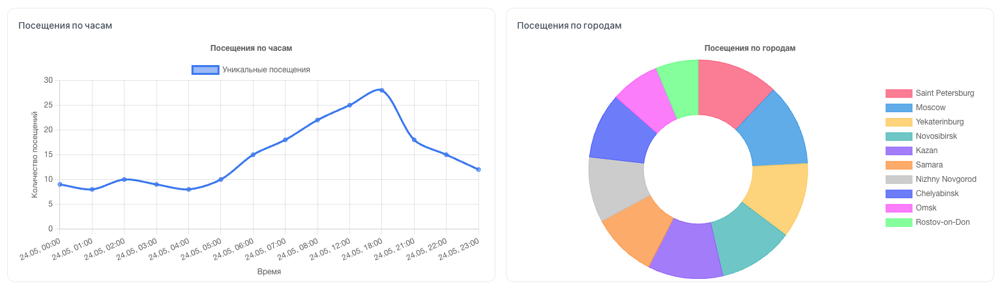

<p align="center"><a href="https://laravel.com" target="_blank"></a></p>

<p align="center">
<a href="https://github.com/laravel/framework/actions"></a>
<a href="https://packagist.org/packages/laravel/framework"></a>
<a href="https://packagist.org/packages/laravel/framework"></a>
<a href="https://packagist.org/packages/laravel/framework"></a>
</p>

## О Laravel

Laravel - это фреймворк для веб-приложений с выразительным, элегантным синтаксисом. Мы считаем, что разработка должна быть приятным и творческим процессом, чтобы приносить истинное удовлетворение.

## О проекте



Данный сервис показывает статистику посещенных сайтов. Скрипт прикрепляется к любому сайту и производит отправку запроса на текущий сервис, который собирает информацию: IP, геоданные, user agent, время посещения.

Встраиваемый скрипт предоставляется на главной странице сервиса.

### Архитектура обработки данных

При обработке данных система использует один из двух сервисов в зависимости от доступной информации:

- **OpenStreetMap** — используется, если переданы координаты (широта и долгота)
- **2IP** — используется, если координаты отсутствуют и нужно определить геоданные по IP

## Настройка

В файле `.env` можно указать токен сервиса 2IP (`2IP_TOKEN`). Если токен не указан, вызов 2IP будет пропущен с предупреждением в логах.

Для локального тестирования предусмотрен тестовый IP. В локальной среде он используется вместо реального IP посетителя, так как в противном случае сервис будет отправлять внутренний IP адрес.

## Запуск

```bash
docker-compose up
docker exec analytics_app php artisan db:seed
```
